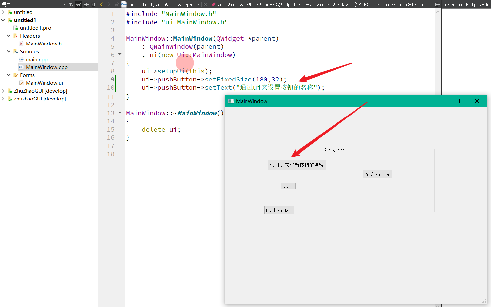
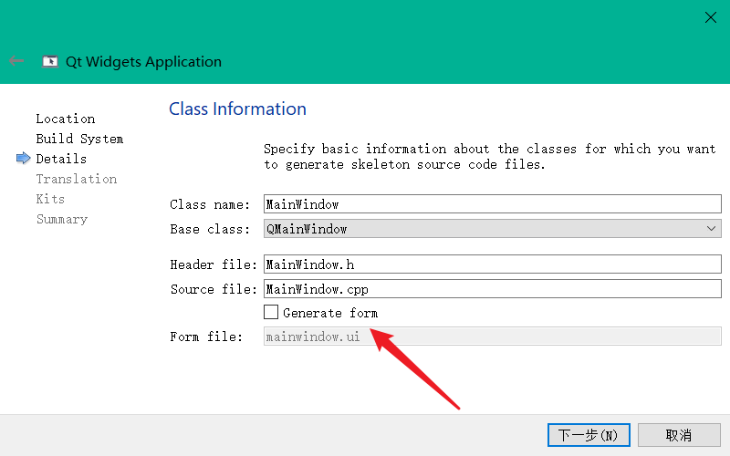
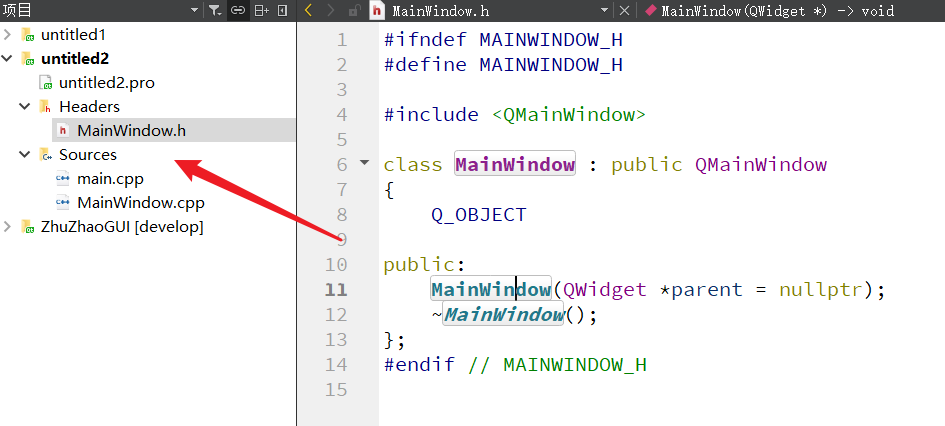

## QT如何去除ui文件进行编程

我们在上一篇带大家洞悉了QT的ui文件的本质。总结来说，就是通过QT的ui设计界面，生成xml序列化文件，这就是ui文件的本地，然后在编译工程时，QT又将xml格式的ui文件进行反射解析，生成一个类，将这个类存到了我们对应界面类的private私有成员中，通过指针得以访问。

我们在上一篇使用ui文件生成了如下界面：



代码就是通过这两行配合ui文件来实现对按钮的设置的：

```c++
ui->pushButton->setFixedSize(180,32);
ui->pushButton->setText("通过ui来设置按钮的名称");
```

### 1、去除ui文件，自行生成按钮并设置

重新新建一个工程，流程和前文一样，唯一不同就是不勾选生成ui文件按钮：


生成的项目结构就仅有.h头文件和.cpp源文件了：



修改源码如下：

MainWindow.h：

```c++
#ifndef MAINWINDOW_H
#define MAINWINDOW_H

#include <QMainWindow>
#include <QPushButton>

class MainWindow : public QMainWindow
{
    Q_OBJECT

public:
    MainWindow(QWidget *parent = nullptr);
    ~MainWindow();

private:
    QPushButton* m_pBtn;
};
#endif // MAINWINDOW_H
```

MainWindow.cpp：

```c++
#include "MainWindow.h"
#include <QLayout>

MainWindow::MainWindow(QWidget *parent)
    : QMainWindow(parent)
    , m_pBtn(Q_NULLPTR)
{
    this->setFixedSize(500,500);
    //创建按钮对象
    m_pBtn = new QPushButton(this);
    m_pBtn->setFixedSize(120,32);
    m_pBtn->setText("通过ui来设置按钮的名称");
    //添加布局设置
    QVBoxLayout* pMainLayout = new QVBoxLayout(this);
    pMainLayout->addWidget(m_pBtn);
    pMainLayout->addStretch();
    QWidget* pCenterWidget = new QWidget(this);
    pCenterWidget->setLayout(pMainLayout);

    this->setCentralWidget(pCenterWidget);
}

MainWindow::~MainWindow()
{
}
```

具体效果大家上手尝试即可，或者观看更为详细的视频教程。


# **不能将布局装到Mainwindow **

```c++
例如：
QHBoxLayout* m_Hlayout = new QHBoxLayout(this);
```

`QMainWindow` 已经有了内部布局，于是 Qt 会在控制台打印警告：

 QLayout: Attempting to add QLayout "" to MainWindow "",
which already has a layout

### 正确做法：用 centralWidget

`QMainWindow` 必须先把一个 `QWidget` 设为中央控件，再把布局设置到这个中央控件上。

先创建 centralWidget，再设置布局

cpp

```c++
MainWindow::MainWindow(QWidget* parent)
    : QMainWindow(parent)
{
    this->setFixedSize(500, 500);

    m_pBtn1->setText("开始");
    m_pBtn1->setFixedSize(100, 50);
    m_pBtn2->setText("结束");
    m_pBtn2->setFixedSize(100, 50);

    // 创建一个中央控件
    QWidget* central = new QWidget(this);
    this->setCentralWidget(central);

    // 布局挂到 central 上
    QHBoxLayout* hlayout = new QHBoxLayout(central);
    hlayout->addWidget(m_pBtn1);
    hlayout->addWidget(m_pBtn2);
}
```


# 1、一步一步拆开讲QMainWindow

## 先搞懂一件事：QMainWindow 是"特殊的窗口"

普通窗口（`QWidget`）就像一张白纸，你可以在上面随便放东西。

`QMainWindow` 不是白纸，它是一张**已经画好格子的纸**：

```text
┌─────────────────────────┐
│  菜单栏 menuBar          │  ← 它已经有了
├─────────────────────────┤
│                         │
│      中央区域            │  ← 它留了一块空白给你用
│    centralWidget        │
│                         │
├─────────────────────────┤
│  状态栏 statusBar        │  ← 它已经有了
└─────────────────────────┘
```

`QMainWindow` 自己**已经带了一个布局**，用来摆放菜单栏、中央区域、状态栏。

所以：

```cpp
new QHBoxLayout(mainWindow);  // ❌ 它已经有布局了，不让你再装
```

**一句话：QMainWindow 已经有布局了，你不能再给它装布局。**

## 那怎么办？用中央区域

`QMainWindow` 说：我给你留了一块空白区域叫 `centralWidget`（中央控件），**你在这块区域里随便折腾**。

但是这块区域一开始是**空的**，需要你先放一个 `QWidget` 进去，它就变成了中央区域。

```cpp
QWidget* central = new QWidget(this);   // 造一块普通的白板
this->setCentralWidget(central);         // 把它设为"中央区域"
```

做完这两步，`central` 就是 `QMainWindow` 的中央区域了。它是一块**普通的 QWidget**，可以装布局。

## 然后就是普通 QWidget 的操作

既然 `central` 是普通 QWidget，那么给普通 QWidget 装布局的两种方法都可以用：

### 方法一：new 布局时传 central

```cpp
QHBoxLayout* layout = new QHBoxLayout(central);
```

`new QHBoxLayout(central)` 相当于：

```cpp
QHBoxLayout* layout = new QHBoxLayout;
central->setLayout(layout);
```

**一步到位**。

### 方法二：先 new 布局，再 setLayout

```cpp
QHBoxLayout* layout = new QHBoxLayout;   // 先造布局，不指定父亲
layout->addWidget(...);                   // 往里面加东西
central->setLayout(layout);               // 最后再装到 central 上
```

**分两步走**。

## 两种写法完全等价

对比一下：

### 方法一

```cpp
QWidget* central = new QWidget(this);
this->setCentralWidget(central);

QHBoxLayout* layout = new QHBoxLayout(central);   // ← 关键行
layout->addWidget(new QPushButton("A"));
layout->addWidget(new QPushButton("B"));
```

### 方法二

```cpp
QWidget* central = new QWidget(this);

QHBoxLayout* layout = new QHBoxLayout;   // ← 不传参
layout->addWidget(new QPushButton("A"));
layout->addWidget(new QPushButton("B"));

central->setLayout(layout);              // ← 手动装
this->setCentralWidget(central);
```

**区别只有一处：**

|              | 方法一                     | 方法二                                           |
| ------------ | -------------------------- | ------------------------------------------------ |
| 装布局的时机 | `new` 的时候               | 手动 `setLayout`                                 |
| 代码         | `new QHBoxLayout(central)` | `new QHBoxLayout` + `central->setLayout(layout)` |

**结果一模一样，选哪个都行。**

## 类比一下帮助理解

把 `QMainWindow` 想象成一栋**已经装修好的房子**：

- 有厨房（菜单栏）
- 有阳台（状态栏）
- 有一间**空房间**（中央区域）

你不能把家具摆在客厅（因为房主已经摆好了），你只能在**那间空房间**里摆。

```cpp
QWidget* central = new QWidget(this);   // 走进那间空房间
this->setCentralWidget(central);         // 宣布：这就是我的房间

// 在房间里摆家具
QHBoxLayout* layout = new QHBoxLayout(central);
layout->addWidget(new QPushButton("A"));
```

## 你之前犯过的错误

再看一遍你之前写的：

```cpp
QWidget* pMainwidget = new QWidget(this);

QHBoxLayout* m_Hlayout = new QHBoxLayout(pMainwidget);   // ✅ 对
pTopwidget->setLayout(m_Hlayout);                         // ❌ 又抢走

QVBoxLayout* m_Vlayout = new QVBoxLayout(pMainwidget);   // ❌ 又装第二个
pMainwidget->setLayout(m_Vlayout);                        // ❌ 多余

this->setCentralWidget(pMainwidget);
```

问题不是"没 `setCentralWidget`"，而是：

1. `m_Hlayout` 已经装到 `pMainwidget` 了，又被 `pTopwidget` 抢走
2. `pMainwidget` 想装两个顶层布局

**`setCentralWidget` 用得没错，错的是布局被装来装去。**

## 完整正确示例

```cpp
MainWindow::MainWindow(QWidget* parent)
    : QMainWindow(parent)
{
    setFixedSize(500, 500);

    // 第一步：给 QMainWindow 设置中央区域
    QWidget* central = new QWidget(this);
    this->setCentralWidget(central);

    // 第二步：在 central（普通 QWidget）上装布局
    // 方法一（推荐）：
    QHBoxLayout* layout = new QHBoxLayout(central);

    // 或者方法二：
    // QHBoxLayout* layout = new QHBoxLayout;
    // central->setLayout(layout);

    // 第三步：往布局里加东西
    layout->addWidget(new QPushButton("A"));
    layout->addWidget(new QPushButton("B"));
}
```

## 一句话总结

- **`QMainWindow` 已经有布局了，不能再给它装布局。**
- **`setCentralWidget(central)` 就是告诉 QMainWindow："这块区域归我用了"。**
- **`central` 是一个普通 QWidget，可以正常装布局。**
- **给 `central` 装布局有两种写法，完全等价：**
  - `new QHBoxLayout(central)`（一步到位）
  - `new QHBoxLayout` + `central->setLayout(layout)`（分两步）

**核心逻辑：QMainWindow 不能装布局 → 那就把布局装到它给你的那块中央区域上。**


# 2、一步一步拆开讲，保证你搞懂

## 先搞懂一件事：QMainWindow 是"特殊的窗口"

普通窗口（`QWidget`）就像一张白纸，你可以在上面随便放东西。

`QMainWindow` 不是白纸，它是一张**已经画好格子的纸**：

```text
┌─────────────────────────┐
│  菜单栏 menuBar          │  ← 它已经有了
├─────────────────────────┤
│                         │
│      中央区域            │  ← 它留了一块空白给你用
│    centralWidget        │
│                         │
├─────────────────────────┤
│  状态栏 statusBar        │  ← 它已经有了
└─────────────────────────┘
```

`QMainWindow` 自己**已经带了一个布局**，用来摆放菜单栏、中央区域、状态栏。

所以：

```cpp
new QHBoxLayout(mainWindow);  // ❌ 它已经有布局了，不让你再装
```

**一句话：QMainWindow 已经有布局了，你不能再给它装布局。**

## 那怎么办？用中央区域

`QMainWindow` 说：我给你留了一块空白区域叫 `centralWidget`（中央控件），**你在这块区域里随便折腾**。

但是这块区域一开始是**空的**，需要你先放一个 `QWidget` 进去，它就变成了中央区域。

```cpp
QWidget* central = new QWidget(this);   // 造一块普通的白板
this->setCentralWidget(central);         // 把它设为"中央区域"
```

做完这两步，`central` 就是 `QMainWindow` 的中央区域了。它是一块**普通的 QWidget**，可以装布局。

## 然后就是普通 QWidget 的操作

既然 `central` 是普通 QWidget，那么给普通 QWidget 装布局的两种方法都可以用：

### 方法一：new 布局时传 central

```cpp
QHBoxLayout* layout = new QHBoxLayout(central);
```

`new QHBoxLayout(central)` 相当于：

```cpp
QHBoxLayout* layout = new QHBoxLayout;
central->setLayout(layout);
```

**一步到位**。

### 方法二：先 new 布局，再 setLayout

```cpp
QHBoxLayout* layout = new QHBoxLayout;   // 先造布局，不指定父亲
layout->addWidget(...);                   // 往里面加东西
central->setLayout(layout);               // 最后再装到 central 上
```

**分两步走**。

## 两种写法完全等价

对比一下：

### 方法一

```cpp
QWidget* central = new QWidget(this);
this->setCentralWidget(central);

QHBoxLayout* layout = new QHBoxLayout(central);   // ← 关键行
layout->addWidget(new QPushButton("A"));
layout->addWidget(new QPushButton("B"));
```

### 方法二

```cpp
QWidget* central = new QWidget(this);

QHBoxLayout* layout = new QHBoxLayout;   // ← 不传参
layout->addWidget(new QPushButton("A"));
layout->addWidget(new QPushButton("B"));

central->setLayout(layout);              // ← 手动装
this->setCentralWidget(central);
```

**区别只有一处：**

|              | 方法一                     | 方法二                                           |
| ------------ | -------------------------- | ------------------------------------------------ |
| 装布局的时机 | `new` 的时候               | 手动 `setLayout`                                 |
| 代码         | `new QHBoxLayout(central)` | `new QHBoxLayout` + `central->setLayout(layout)` |

**结果一模一样，选哪个都行。**

## 类比一下帮助理解

把 `QMainWindow` 想象成一栋**已经装修好的房子**：

- 有厨房（菜单栏）
- 有阳台（状态栏）
- 有一间**空房间**（中央区域）

你不能把家具摆在客厅（因为房主已经摆好了），你只能在**那间空房间**里摆。

```cpp
QWidget* central = new QWidget(this);   // 走进那间空房间
this->setCentralWidget(central);         // 宣布：这就是我的房间

// 在房间里摆家具
QHBoxLayout* layout = new QHBoxLayout(central);
layout->addWidget(new QPushButton("A"));
```

## 你之前犯过的错误

再看一遍你之前写的：

```cpp
QWidget* pMainwidget = new QWidget(this);

QHBoxLayout* m_Hlayout = new QHBoxLayout(pMainwidget);   // ✅ 对
pTopwidget->setLayout(m_Hlayout);                         // ❌ 又抢走

QVBoxLayout* m_Vlayout = new QVBoxLayout(pMainwidget);   // ❌ 又装第二个
pMainwidget->setLayout(m_Vlayout);                        // ❌ 多余

this->setCentralWidget(pMainwidget);
```

问题不是"没 `setCentralWidget`"，而是：

1. `m_Hlayout` 已经装到 `pMainwidget` 了，又被 `pTopwidget` 抢走
2. `pMainwidget` 想装两个顶层布局

**`setCentralWidget` 用得没错，错的是布局被装来装去。**

## 完整正确示例

```cpp
MainWindow::MainWindow(QWidget* parent)
    : QMainWindow(parent)
{
    setFixedSize(500, 500);

    // 第一步：给 QMainWindow 设置中央区域
    QWidget* central = new QWidget(this);
    this->setCentralWidget(central);

    // 第二步：在 central（普通 QWidget）上装布局
    // 方法一（推荐）：
    QHBoxLayout* layout = new QHBoxLayout(central);

    // 或者方法二：
    // QHBoxLayout* layout = new QHBoxLayout;
    // central->setLayout(layout);

    // 第三步：往布局里加东西
    layout->addWidget(new QPushButton("A"));
    layout->addWidget(new QPushButton("B"));
}
```

## 一句话总结

- **`QMainWindow` 已经有布局了，不能再给它装布局。**
- **`setCentralWidget(central)` 就是告诉 QMainWindow："这块区域归我用了"。**
- **`central` 是一个普通 QWidget，可以正常装布局。**
- **给 `central` 装布局有两种写法，完全等价：**
  - `new QHBoxLayout(central)`（一步到位）
  - `new QHBoxLayout` + `central->setLayout(layout)`（分两步）

**核心逻辑：QMainWindow 不能装布局 → 那就把布局装到它给你的那块中央区域上。**


# 3、控件和布局之间的 add / set 方法全整理

先明确两个角色：

- **控件**（`QWidget` 及其子类，比如 `QPushButton`、`QWidget`）
- **布局**（`QLayout` 及其子类，比如 `QHBoxLayout`、`QVBoxLayout`、`QGridLayout`）

它们之间的关系操作主要就几类，下面一个一个列。

---

## 一、布局 → 加东西（add 系列）

### 1. `addWidget`：布局加控件

最常用。把一个控件交给布局管理。

```cpp
QWidget* w = new QWidget;
QHBoxLayout* h = new QHBoxLayout(w);

QPushButton* btn = new QPushButton("按钮");
h->addWidget(btn);   // 把按钮加到布局里
```

### 2. `addLayout`：布局加子布局

布局里嵌套另一个布局。

```cpp
QVBoxLayout* mainLayout = new QVBoxLayout(widget);

QHBoxLayout* subLayout = new QHBoxLayout;   // 子布局
subLayout->addWidget(new QPushButton("A"));
subLayout->addWidget(new QPushButton("B"));

mainLayout->addLayout(subLayout);   // 把子布局嵌进主布局
```

### 3. `addStretch`：布局加弹簧

弹簧会占满多余空间，用来控制控件位置。

```cpp
QHBoxLayout* h = new QHBoxLayout(widget);

h->addStretch();                    // 左边弹簧
h->addWidget(new QPushButton("A"));
h->addWidget(new QPushButton("B"));
h->addStretch();                    // 右边弹簧
// 效果：按钮居中
```

### 4. `addSpacing`：布局加固定间距

加一段**固定像素**的空白。

```cpp
QVBoxLayout* v = new QVBoxLayout(widget);

v->addWidget(new QPushButton("按钮1"));
v->addSpacing(20);                  // 中间空 20 像素
v->addWidget(new QPushButton("按钮2"));
```

### 5. `QGridLayout::addWidget`：网格布局加控件（带行列）

`QGridLayout` 需要指定行列。

```cpp
QGridLayout* grid = new QGridLayout(widget);

grid->addWidget(new QLabel("用户名"), 0, 0);   // 第0行第0列
grid->addWidget(new QLineEdit,       0, 1);   // 第0行第1列
grid->addWidget(new QLabel("密码"),  1, 0);   // 第1行第0列
grid->addWidget(new QLineEdit,       1, 1);   // 第1行第1列
```

### 6. `QFormLayout::addRow`：表单布局加"标签 + 字段"

表单专用。

```cpp
QFormLayout* form = new QFormLayout(widget);

form->addRow("用户名：", new QLineEdit);
form->addRow("密码：",   new QLineEdit);
```

---

## 二、控件 → 装布局（set 系列）

### 7. `setLayout`：给控件装一个顶层布局

一个控件**只能有一个顶层布局**。

```cpp
QWidget* w = new QWidget;

QHBoxLayout* h = new QHBoxLayout;   // 先 new 布局
h->addWidget(new QPushButton("A"));
h->addWidget(new QPushButton("B"));

w->setLayout(h);                    // 再装到控件上
```

### 8. `new QLayout(widget)`：new 的时候顺便装上去

等价于 `setLayout`。

```cpp
QWidget* w = new QWidget;

QHBoxLayout* h = new QHBoxLayout(w);  // 直接装到 w 上
h->addWidget(new QPushButton("A"));
```

**注意：`QMainWindow` 不能用这两种，必须先 `setCentralWidget`。**

### 9. `setCentralWidget`：QMainWindow 专用

给 `QMainWindow` 设置中央区域控件。

```cpp
QWidget* central = new QWidget(this);
this->setCentralWidget(central);

QHBoxLayout* h = new QHBoxLayout(central);
h->addWidget(new QPushButton("A"));
```

---

## 三、查询关系（get 系列）

### 10. `layout()`：获取控件当前的顶层布局

```cpp
QWidget* w = new QWidget;
QHBoxLayout* h = new QHBoxLayout(w);

QLayout* cur = w->layout();   // 返回 h
```

### 11. `parentWidget()`：获取布局所属的控件

```cpp
QHBoxLayout* h = new QHBoxLayout(w);
QWidget* owner = h->parentWidget();   // 返回 w
```

### 12. `count()` / `itemAt()`：遍历布局里的项

```cpp
QHBoxLayout* h = new QHBoxLayout(w);
h->addWidget(new QPushButton("A"));
h->addWidget(new QPushButton("B"));

int n = h->count();                    // 2
QLayoutItem* item = h->itemAt(0);      // 第一个项
QWidget* first = item->widget();       // 拿到第一个控件
```

---

## 四、删除/移除（remove 系列）

### 13. `removeWidget`：从布局里移除控件（但不删除）

```cpp
QHBoxLayout* h = new QHBoxLayout(w);
QPushButton* btn = new QPushButton("A");
h->addWidget(btn);

h->removeWidget(btn);   // 从布局里移除，但 btn 还在，只是没人管位置了
```

### 14. `removeItem`：移除布局项

```cpp
QLayoutItem* item = h->takeAt(0);
delete item;   // 需要自己 delete
```

---

## 五、总览表

| 方法                              | 方向          | 作用           |
| --------------------------------- | ------------- | -------------- |
| `layout->addWidget(w)`            | 布局 → 控件   | 布局加控件     |
| `layout->addLayout(sub)`          | 布局 → 布局   | 布局加子布局   |
| `layout->addStretch()`            | 布局 → 弹簧   | 占满剩余空间   |
| `layout->addSpacing(n)`           | 布局 → 间距   | 固定间距       |
| `grid->addWidget(w, r, c)`        | 网格 → 控件   | 按行列加控件   |
| `form->addRow(label, field)`      | 表单 → 控件   | 加标签行       |
| `widget->setLayout(layout)`       | 控件 → 布局   | 装顶层布局     |
| `new QLayout(widget)`             | 控件 → 布局   | 构造时装布局   |
| `mainWindow->setCentralWidget(w)` | 主窗口 → 控件 | 设中央控件     |
| `widget->layout()`                | 控件 → 布局   | 取当前布局     |
| `layout->parentWidget()`          | 布局 → 控件   | 取所属控件     |
| `layout->removeWidget(w)`         | 布局 → 控件   | 从布局移除控件 |

---

## 六、完整综合例子

下面这个例子把常见的 add / set 都用了一遍：

```cpp
QWidget* window = new QWidget;

// 主布局：垂直
QVBoxLayout* mainLayout = new QVBoxLayout(window);

// 上面一行：水平布局
QHBoxLayout* topLayout = new QHBoxLayout;
topLayout->addWidget(new QLabel("用户名："));
topLayout->addWidget(new QLineEdit);

// 中间一行：水平布局
QHBoxLayout* midLayout = new QHBoxLayout;
midLayout->addWidget(new QLabel("密码："));
midLayout->addWidget(new QLineEdit);

// 下面一行：两个按钮
QHBoxLayout* btnLayout = new QHBoxLayout;
btnLayout->addStretch();
btnLayout->addWidget(new QPushButton("确定"));
btnLayout->addWidget(new QPushButton("取消"));

// 嵌进主布局
mainLayout->addLayout(topLayout);
mainLayout->addSpacing(10);
mainLayout->addLayout(midLayout);
mainLayout->addSpacing(10);
mainLayout->addLayout(btnLayout);
mainLayout->addStretch();

window->show();
```

效果：

```text
用户名： [________]
（空 10 像素）
密码：   [________]
（空 10 像素）
            [确定] [取消]
（剩余空间）
```

---

## 七、一句话总结

**方向就两种：**

1. **布局加东西** → `addWidget` / `addLayout` / `addStretch` / `addSpacing`
2. **控件装布局** → `setLayout` / `new QLayout(widget)` / `setCentralWidget`

**再加上查询（`layout()`）和移除（`removeWidget`），一共就这么几个。**

记住：

- **add 是布局对内部**（加控件、加子布局、加弹簧）
- **set 是控件对外**（控件设置自己的布局）
- **QMainWindow 特殊**，用 `setCentralWidget` 绕过它不能装布局的限制